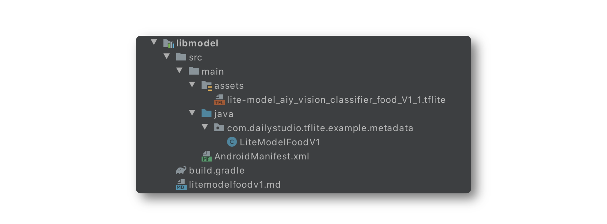

# TensorFlow Lite Code Generator

For TensorFlow Lite model enhanced with metadata, developers can use the TensorFlow Lite Android wrapper code generator to create platform-specific wrapper code. The wrapper code removes the need to interact directly with ByteBuffer. Instead, developers can interact with the TensorFlow Lite model with typed objects such as Bitmap and Rect.

## Preparation
Before getting started, you need to assure the following things prerequisites are ready:

- Android Studio 4.1 or later
- An Android device (mobile phones are better) with Android 5.0+ (API Level 21)
- TensorFlow Lite model - [food_v1](https://tfhub.dev/google/aiy/vision/classifier/food_V1/1)

> In the following steps, we assume that 
>
> - you clone the repository into this specific directory, **/Volumes/Workspace/gitrepos/dailystudio/tflite-run-inference-with-metadata/** 
> - you put models in the download directory, **/Volumes/Workspace/sandbox/tflite-example/models/** 
> - your target working directory is **/Volumes/Workspace/sandbox/tflite-example/**

## Let's go

### Initialize the project from the boilerplate

Copy the boilerplate project into your destination and import it into Android Studio.

``` Shell
$ cd /Volumes/Workspace/sandbox/tflite-example/
$ cp -a /Volumes/Workspace/gitrepos/dailystudio/tflite-run-inference-with-metadata/boilerplate codegen
```

### Generate code as a library project
Install the **tflite-support** package through **pip**,

``` Shell
$ pip install tflite-support

Processing /Users/yenan/Library/Caches/pip/wheels/25/13/7a/2aa10dac8ea1dcd41d828123b7904e7174d135870bd4a07fa1/tflite_support-0.1.0a1-cp39-cp39-macosx_10_15_x86_64.whl
Requirement already satisfied: numpy in /usr/local/lib/python3.9/site-packages (from tflite-support) (1.20.1)
Requirement already satisfied: pybind11>=2.4 in /usr/local/lib/python3.9/site-packages (from tflite-support) (2.6.2)
Requirement already satisfied: absl-py>=0.7.0 in /usr/local/lib/python3.9/site-packages (from tflite-support) (0.11.0)
Requirement already satisfied: six in /usr/local/lib/python3.9/site-packages (from absl-py>=0.7.0->tflite-support) (1.15.0)
Installing collected packages: tflite-support
Successfully installed tflite-support-0.1.0a1
```

Use **tflite_codegen** generate the library project,

```Shell
$ cd codegen
$ tflite_codegen --model ../models/lite-model_aiy_vision_classifier_food_V1_1.tflite \
--package_name com.dailystudio.tflite.example.metadata \
--model_class_name LiteModelFoodV1 \
--destination libmodel
```

The library project will be generated under directory **libmodel** and the structure  will like this:


### Add dependency of the library project
Include library project in **settings.gradle**

```Groovy
include ':libmodel'
```
Compile library project in **app/build.gradle** and exclude duplicated dependencies of TensorFlow Lite Metadata support library.

```Groovy
implementation ('com.dailystudio:tensorflow-lite-viewer:0.1.4') {
    exclude (group: 'org.tensorflow', module: 'tensorflow-lite-metadata')
}

implementation project(':libmodel')

```

### Edit the code

Modify the implementation of **ImageClassifierAnalyzer** to run the inference of the model.

Changing classifier declaration to your specific type:

```Kotlin
private var classifier: LiteModelFoodV1? = null
```

In **analyzeFrame()**, creating an instance of classifier and call run() to do the inference. To keep higher logics unchanged,  we need to convert outputs to a sorted list manually.

```Kotlin
...
    val categories: MutableList<Category> =
        mutableListOf()

    synchronized(lock) {
        classifier = classifier ?: LiteModelFoodV1(context)

        classifier?.let {
            val inputs: LiteModelFoodV1.Inputs  = it.createInputs()
            inputs.loadImage(tImage)

            val outputs = classifier?.run(inputs)?.probability
            outputs?.let { map ->
                categories.addAll(map.toList().map { pair ->
                    Category.create(pair.first, pair.first, pair.second)
                }.sortedByDescending { category ->
                    category.score
                })
            }
        }
    }
...
```

Generated library will use default label file attached in TensorFlite Lite Model. But that label is not the correct one. Labels stored in that is not human-readable. You should modify the code in library projec to use the correct one. Modify the following line in **Metadata**'s constrcutor in **LiteModelFoodV1.java**.

The original one is:

```java
String probabilityLabelsFileName =
  extractor.getOutputTensorMetadata(0).associatedFiles(0).name();
```

And updated one is

```java
String probabilityLabelsFileName =
  extractor.getOutputTensorMetadata(0).associatedFiles(1).name();
```


### Launch the app

Launch the app and you will see the results,


### Support GPU and multi-threads inference
Generated code allows developers to accelerate the inference through the use of delegates and the number of threads.

The boilerplate provides a settings UI to configure these parameters. The values of the settings are store in **InferenceSettingsPrefs.instance**. In **ImageClassifierAnalyzer**, you can access these values to build your model with acceleration support:

```Kotlin
    private fun createModel(context: Context): LiteModelFoodV1 {
        val deviceStr = InferenceSettingsPrefs.instance.device
        val numOfThreads = InferenceSettingsPrefs.instance.numberOfThreads

        val device = try {
            Model.Device.valueOf(deviceStr)
        } catch (e: Exception) {
            Logger.error("failed to parse device from [${deviceStr}]: $e")
            Model.Device.CPU
        }

        return when (device) {
            Model.Device.CPU, Model.Device.NNAPI -> {
                LiteModelFoodV1(context, device, numOfThreads)
            }
            Model.Device.GPU -> {
                LiteModelFoodV1(context, device, 1)
            }
        }
    }

```

Then creating classifier with these acceleration:

```Kotlin
    classifier = classifier ?: createModel(context)
```

You should close the classifier when the settings are changed. So that, the new classifier will be recreated in **analyzeFrame()** in the coming round.

```Kotlin
    override fun onInferenceSettingsChange(changePrefName: String) {
        super.onInferenceSettingsChange(changePrefName)

        when (changePrefName) {
            InferenceSettingsPrefs.PREF_DEVICE, InferenceSettingsPrefs.PREF_NUMBER_OF_THREADS -> {
                GlobalScope.launch (Dispatchers.IO) {
                    synchronized(lock) {
                        classifier?.close()

                        classifier = null
                    }
                }
            }
        }
    }
```

Re-launch the app, you will see:


## Tips

There are a few tips when you should notice:

- The library project generated by **tflite_codegen** contains a **tensorflow-lite-support-metadata.jar**. That would be conflicted with host project when there is also a dependency on **org.tensorflow:tensorflow-lite-support-metadata**. You had to solve the problem by using **exclude** in **build.gradle**
- By default, generated code will use **the first label file** attached in the model. It is **incorrect**. You should change the code and pick the right one by yourself.
