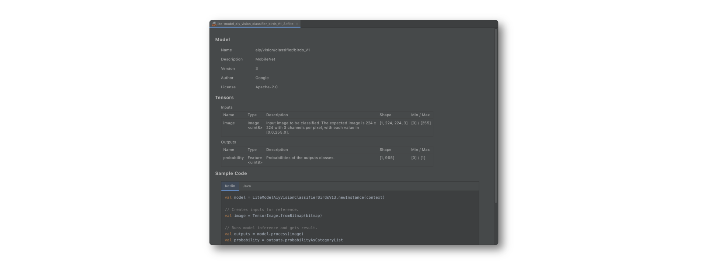
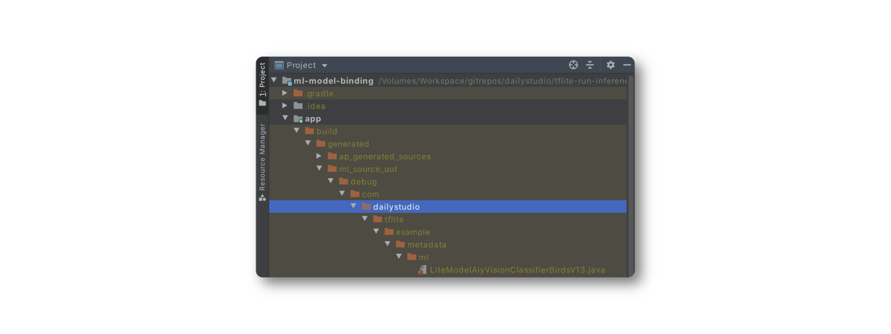

# Android Studio ML Model Binding

For TensorFlow Lite models enhanced with metadata, developers can use Android Studio ML Model Binding to automatically configure settings for the project and generate wrapper classes based on the model metadata.

## Preparation
Before getting started, you need to assure the following things prerequisites are ready:

- Android Studio 4.1 or later
- An Android device (mobile phones are better) with Android 5.0+ (API Level 21)
- TensorFlow Lite model - [birds_v1](https://tfhub.dev/google/aiy/vision/classifier/birds_V1/1)

> In the following steps, we assume that 
>
> - you clone the repository into this specific directory, **/Volumes/Workspace/gitrepos/dailystudio/tflite-run-inference-with-metadata/** 
> - you put models in the download directory, **~/Download/** 
> - your target working directory is **/Volumes/Workspace/sandbox/tflite-example/**

## Let's go

### Initialize the project from  the boilerplate

Copy the boilerplate project into your destination and import it into Android Studio.

``` Shell
$ cd /Volumes/Workspace/sandbox/tflite-example/
$ cp -a /Volumes/Workspace/gitrepos/dailystudio/tflite-run-inference-with-metadata/boilerplate ml-model-binding
```

### Import the model 
Following the instructions in the official document [Import a TensorFlow Lite model in Android Studio](https://www.tensorflow.org/lite/inference_with_metadata/codegen#import_a_tensorflow_lite_model_in_android_studio), then you will see the model information like this:



And the generated Java wrapper class is here:




You can open it to review the code generated by ML Model Binding.

### Edit the code

Modify the implementation of **ImageClassifierAnalyzer** to run the inference of the model.

Changing classifier declaration to your specific type:

```Kotlin
private var classifier: LiteModelAiyVisionClassifierBirdsV13? = null
```

In **analyzeFrame()**, creating an instance of classifier and call process() to do the inference.

```Kotlin
...
    synchronized(lock) {
        classifier = classifier ?:
                LiteModelAiyVisionClassifierBirdsV13.newInstance(
                    context)

        categories = classifier?.process(tImage)?.probabilityAsCategoryList?.apply {
            sortByDescending {
                it.score
            }
        }
    }
...
```

### Launch the app

Launch the app and you will see the results,


### Support GPU and multi-threads inference
ML Model Binding allows developers to accelerate the inference through the use of delegates and the number of threads.

The boilerplate provides a settings UI to configure these parameters. The values of the settings are store in **InferenceSettingsPrefs.instance**. In ** ImageClassifierAnalyzer**, you can access these values to build your options:

```Kotlin
    private fun getModelOptions(): Model.Options {
        val deviceStr = InferenceSettingsPrefs.instance.device
        val numOfThreads = InferenceSettingsPrefs.instance.numberOfThreads

        val device = try {
            Model.Device.valueOf(deviceStr)
        } catch (e: Exception) {
            Model.Device.CPU
        }

        val builder = Model.Options.Builder()
            .setDevice(device)
        if (device != Model.Device.GPU) {
            builder.setNumThreads(numOfThreads)
        }

        return builder.build()
    }

```

Then creating classifier with these options:

```Kotlin
    classifier = classifier ?: LiteModelAiyVisionClassifierBirdsV13
            .newInstance(context, getModelOptions())

```

Re-launch the app, you will see:


## Tips

There are a few tips when you should notice:

- The Bitmap passed into **ImageClassifierAnalyzer.analyzeFrame()** is not the original one that we get from the CameraX API. We have applied a set of pre-processing actions on the Bitmap before that. Check the implementation of **ImageClassifierAnalyzer.preProcessImage()**. 
- **probabilityAsCategoryList** returned by inference is sorted with a score in ascending order. You should sort it before you present the top three results to users.
